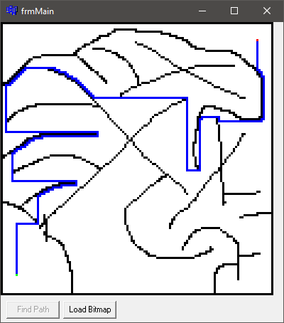

# Path Finder

### About:
Finds a path through a loaded maze.

### Instructions:
Run the executable and load a bitmap maze - a green pixel represents the starting location, a red pixel represents the goal, white pixels are open space and black pixels are walls/barriers.

### Screenshot:

### Info:
**Created:** 2002

**Operating System:** Windows 2000 or newer

**Compile with:** Borland C++ Builder 6
